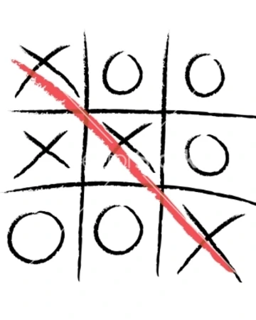

# TicTacToepy
As the name suggests, this repository is the game of TicTacToe in Python. It contains a script tictactoe.py . 

The above image is taken from Google Images. It shows a simple game of tictactoe. As we can see, it is basically a 3X3 grid. Two players play this game turn by turn. One of them plays with 'X's while the other plays with 'O's.

# Parts of the Program
For the grid, I have used 3 lists denoting each row of the 3X3 grid. I have created a function which checks if the grid at a certain point of time contains a winner. 

I have also created a function which places a certain input in the lists according to the positions. 
There is a function for printing the grid as well. 

All these functions are combined in the main() function. The main() function keeps taking input until either player wins or the grid is filled and it is a draw.

# What this project taught me
I have been using python for just less than a year now. I have done more complex projects including some work in the field of Machine Learning and a few projects using the Flask framework. 

This project took me back to the basics of Python, which includes loops, conditionals etc. If anyone is learning any language right now, then they can, after having a good grip over fundamentals such as conditionals and loops, can attempt to make this project. 

# Further Ideas
I would like to create a Graphic User Interface(GUI) for the game. That would complete this project.